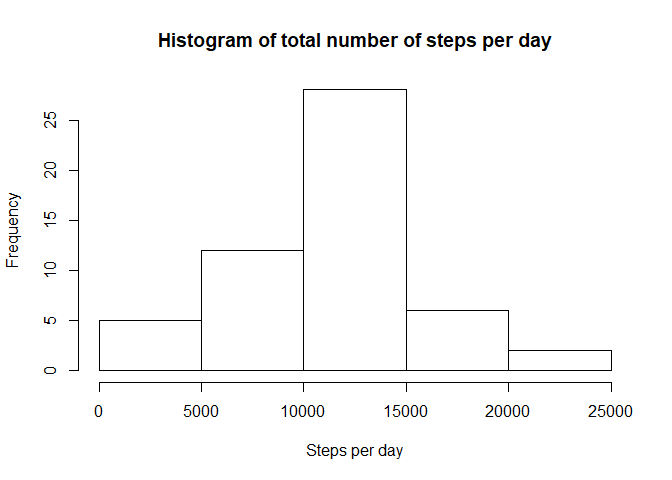
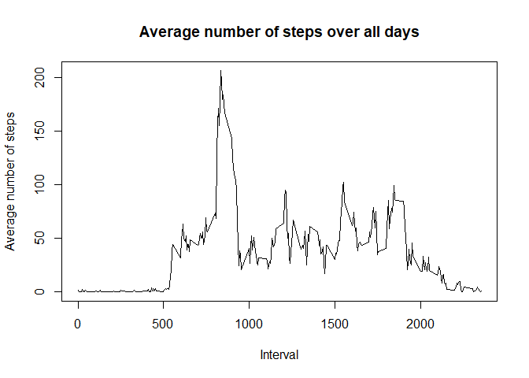
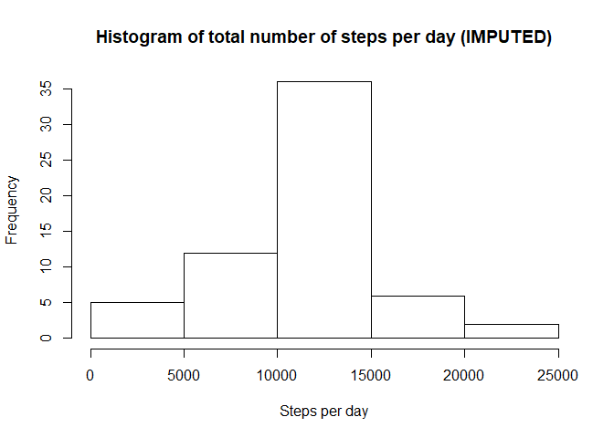
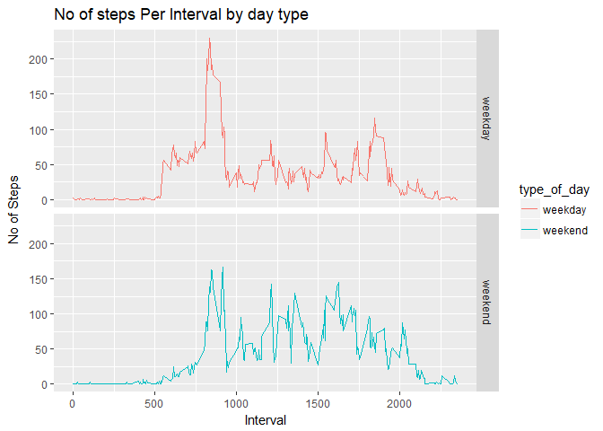

Loading and preprocessing the data
----------------------------------

    # load the dataset
    activity <- read.csv('activity.csv')

    # Remove the NA values and store in a separate structure for future use
    activity_complete <- activity[complete.cases(activity), ]

Attaching "dplyr" package for simple filtering and summarisation of data
------------------------------------------------------------------------

    library(dplyr)

    ## Warning: package 'dplyr' was built under R version 3.4.3

    ## 
    ## Attaching package: 'dplyr'

    ## The following objects are masked from 'package:stats':
    ## 
    ##     filter, lag

    ## The following objects are masked from 'package:base':
    ## 
    ##     intersect, setdiff, setequal, union

What is mean total number of steps taken per day?
-------------------------------------------------

1.  Calculating the total number of steps taken per day

<!-- -->

    StepsPerDay<- activity_complete %>% group_by(date) %>% summarise(total= sum(steps))

1.  plotting a histogram of the total number of steps taken each day

<!-- -->

    hist(StepsPerDay$total, main = "Histogram of total number of steps per day", xlab = "Steps per day")

1.  Calculating and reporting the mean and median of the total number of
    steps taken per day

<!-- -->

    # Calculating the mean of the total number of steps taken per day
    meanStepPerDay<- round(mean(StepsPerDay$total),2)

    # Calculating the median of the total number of steps taken per day
    medianStepPerDay<- median(StepsPerDay$total)

    ## print mean & median
    print(meanStepPerDay)

    ## [1] 10766.19

    print(medianStepPerDay)

    ## [1] 10765

What is the average daily activity pattern?
-------------------------------------------

1.  Make a time series plot (i.e. type = "l") of the 5-minute
    interval (x-axis) and the average number of steps taken, averaged
    across all days (y-axis)
2.  Which 5-minute interval, on average across all the days in the
    dataset, contains the maximum number of steps?

<!-- -->

    # preprocessing data for plot
    ave_steps_per_interval <- aggregate(steps ~ interval, activity_complete, mean)

    # create a time series plot 
    plot(ave_steps_per_interval$interval, ave_steps_per_interval$steps, type='l', 
         main="Average number of steps over all days", xlab="Interval", 
         ylab="Average number of steps")

1.  Which 5-minute interval, on average across all the days in the
    dataset, contains the maximum number of steps?

<!-- -->

    # find row with max of steps
    max_steps_row <- which.max(ave_steps_per_interval$steps)

    # find interval with this max
    ave_steps_per_interval[max_steps_row, ]

    ##     interval    steps
    ## 104      835 206.1698

Imputing missing values
-----------------------

1.  Calculate and report the total number of missing values in the
    dataset (i.e. the total number of rows with NAs)

<!-- -->

    total_missing_value<-sum(is.na(activity))
    print(total_missing_value)

    ## [1] 2304

1.  Devise a strategy for filling in all of the missing values in
    the dataset. The strategy does not need to be sophisticated. For
    example, you could use the mean/median for that day, or the mean for
    that 5-minute interval, etc.

2.  Create a new dataset that is equal to the original dataset but with
    the missing data filled in.

<!-- -->

    # Loop thru all the rows of activity, find the one with NA for steps.
    # For each identify the interval for that row
    # Then identify the avg steps for that interval in avg_steps_per_interval
    # Substitute the NA value with that value

    ave_steps_per_interval <- aggregate(steps ~ interval, activity_complete, mean)

    for (i in 1:nrow(activity)) {
        if(is.na(activity$steps[i])) {
            val <- ave_steps_per_interval$steps[which(ave_steps_per_interval$interval == activity$interval[i])]
            activity$steps[i] <- val 
        }
    }

    # Aggregate the steps per day with the imputed values
    steps_per_day_impute <- aggregate(steps ~ date, activity, sum)

1.  Make a histogram of the total number of steps taken each day and
    Calculate and report the mean and median total number of steps taken
    per day. Do these values differ from the estimates from the first
    part of the assignment? What is the impact of imputing missing data
    on the estimates of the total daily number of steps

<!-- -->

    # Draw a histogram of the value 
    hist(steps_per_day_impute$steps, main = "Histogram of total number of steps per day (IMPUTED)", xlab = "Steps per day")

    # get mean and median of imputed data
    mean_imputed_dataset<-round(mean(steps_per_day_impute$steps),2)
    median_imputed_dataset<- median(steps_per_day_impute$steps)
    print(paste("imputed mean= ", mean_imputed_dataset))

    ## [1] "imputed mean=  10766.19"

    print(paste("imputed median= ",  median_imputed_dataset))

    ## [1] "imputed median=  10766.1886792453"

    # get mean and median of data without NA's
    print(paste("mean without na= ", meanStepPerDay))

    ## [1] "mean without na=  10766.19"

    print(paste("median without na= ",  medianStepPerDay))

    ## [1] "median without na=  10765"

Are there differences in activity patterns between weekdays and weekends?
-------------------------------------------------------------------------

1.  Create a new factor variable in the dataset with two levels -
    "weekday" and "weekend" indicating whether a given date is a weekday
    or weekend day.

<!-- -->

    ## adding new colunm in Iputed dataset "Activity"
    activity['type_of_day'] <- weekdays(as.Date(activity$date))

    ## splitting type of day in two categories as per "weekday" & "weekends"
    activity$type_of_day[activity$type_of_day  %in% c('Saturday','Sunday') ] <- "weekend"
    activity$type_of_day[activity$type_of_day != "weekend"] <- "weekday"

    # convert type_of_day from character to factor
    activity$type_of_day<- as.factor(activity$type_of_day)
    summary(activity$type_of_day)

    ## weekday weekend 
    ##   12960    4608

1.  Make a panel plot containing a time series plot (i.e. type = "l") of
    the 5-minute interval (x-axis) and the average number of steps
    taken, averaged across all weekday days or weekend days (y-axis).
    See the README file in the GitHub repository to see an example of
    what this plot should look like using simulated data.

<!-- -->

    #load the ggplot library
    library(ggplot2)

    ## Warning: package 'ggplot2' was built under R version 3.4.3

    # Create the aggregated data frame by intervals and day_type
    steps_per_day_impute <- aggregate(steps ~ interval+ type_of_day, activity, mean)

    # Create the plot
    plt <- ggplot(steps_per_day_impute, aes(interval, steps)) +
        geom_line(stat = "identity", aes(colour = type_of_day)) +
        facet_grid(type_of_day ~ ., scales="fixed", space="fixed") +
        labs(x="Interval", y=expression("No of Steps")) +
        ggtitle("No of steps Per Interval by day type")
    print(plt)

